<p align="center">
  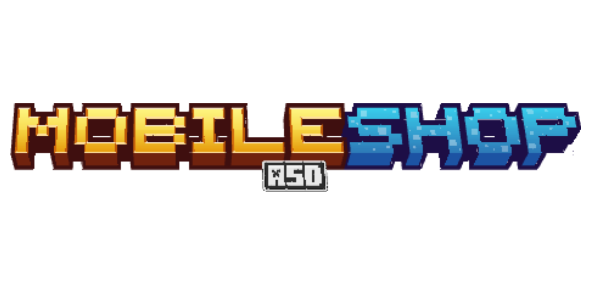
</p>

<h1 align="center">MobileShopASD</h1>

<p align="center">
  Advanced Marketplace Infrastructure • Player Shop Ecosystem • Discord Commerce
</p>

<p align="center">
  
</p>

<p align="center">
  
  
  
  
</p>

<p align="center">
  
  
  
</p>

---

<p align="center">
  
</p>

<p align="center">
  
</p>

MobileShopASD is an advanced player marketplace infrastructure plugin focused on creating immersive, progression-based and highly interactive shop ecosystems.

Unlike traditional player shop plugins, MobileShopASD was designed as a complete commercial infrastructure connecting:
-  Player shops
-  Physical markets
-  Discord commerce
-  Progression systems
-  Ranking infrastructure
-  Offline delivery systems

The plugin transforms trading into a real gameplay system instead of simple chest interactions.

---

<p align="center">
  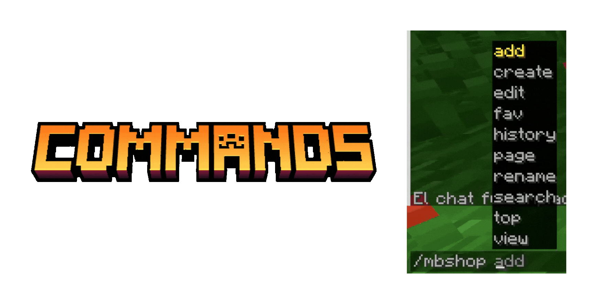
</p>

<p align="center">
  
</p>

```txt
/mbshop
/mbshop create
/mbshop edit
/mbshopadmin
/levelup
/shop
```

<details>
<summary>

View Detailed Command Infrastructure
</summary>

<br>

The command architecture inside MobileShopASD was designed to centralize the entire marketplace ecosystem into modern GUI-driven workflows.

###  Chat Integration

Players can quickly access their shops directly from chat using:
```txt
#shop
```

This creates a much faster and cleaner trading experience, especially for active servers with large economies.

###  Administrative Infrastructure

Administrators can:
- manage shop levels
- edit market instances
- force upgrades
- synchronize NPCs
- configure ratings
- control cooldowns
- manage boosters
- synchronize Discord systems

without requiring server restarts.

### <span style="color:#F6B04E"><b>Marketplace-Oriented Design</b></span>

The objective was creating a scalable player economy ecosystem rather than isolated player shops.

</details>

---

<p align="center">
  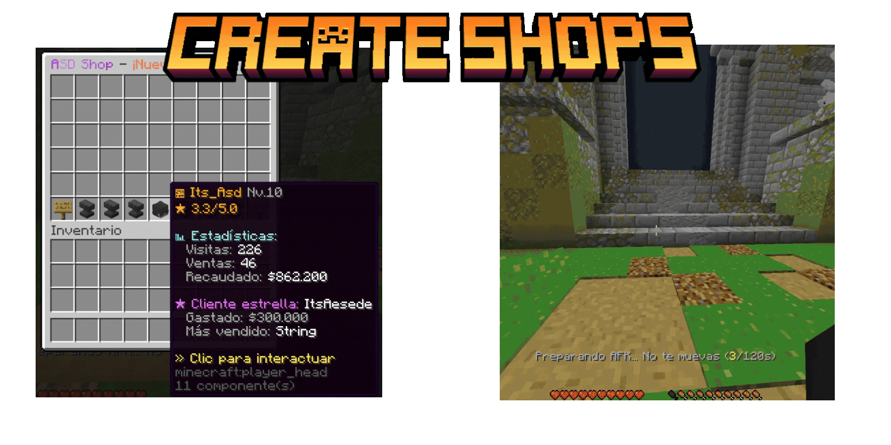
</p>

<p align="center">
  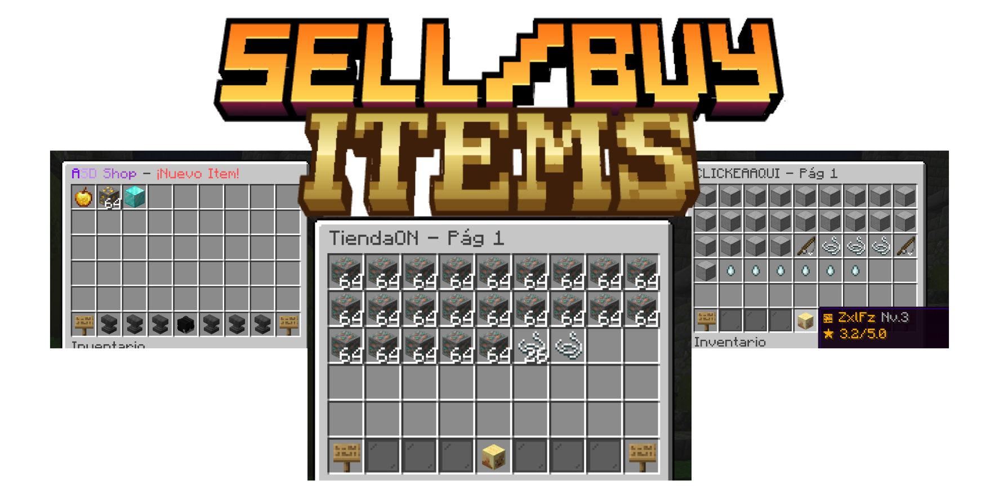
</p>

<p align="center">
  
</p>

<details>
<summary>

View Detailed Player Shop System
</summary>

<br>

MobileShopASD allows players to create fully customizable mobile shops directly connected to the server economy.

###  Dynamic Trading

Players can:
- sell items
- buy items
- customize pages
- upgrade shops
- configure layouts
- manage products
- rename sections

through interactive GUIs.

###  Real Marketplace Feeling

The system was designed to make trading feel:
- alive
- competitive
- immersive
- progression-oriented

instead of static chest menus.

</details>

---

<p align="center">
  
</p>

<p align="center">
  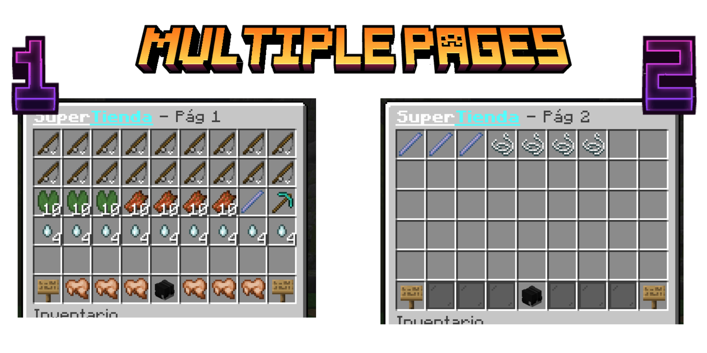
</p>

<p align="center">
  
</p>

<details>
<summary>

View Detailed Shop Editor
</summary>

<br>

The Shop Editor is one of the core systems inside MobileShopASD.

It allows players to completely customize their marketplace experience.

###  Editable Shop Infrastructure

Players can configure:
- multiple pages
- page names
- product slots
- visual organization
- categories
- item prices
- product layouts

### <span style="color:#F6B04E"><b>Modern GUI Workflow</b></span>

The plugin was specifically designed to avoid old-style command-only trading systems.

Everything is managed through modern GUI interactions.

</details>

---

<p align="center">
  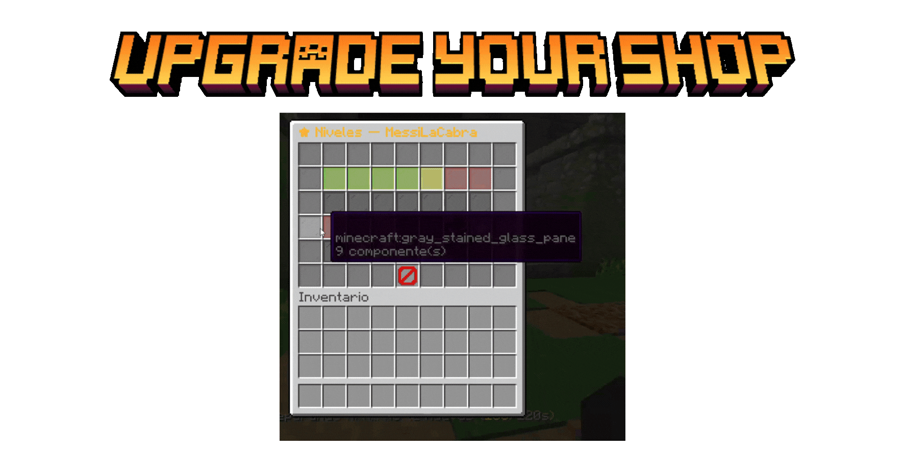
</p>

<p align="center">
  
</p>

<details>
<summary>

View Detailed Level System
</summary>

<br>

MobileShopASD includes a progression-oriented level system for player shops.

###  Upgradeable Shops

Players can level up their shops through:
- visits
- money earned
- successful transactions
- activity
- progression milestones

###  Unlockable Benefits

Higher levels can unlock:
- more pages
- custom colors
- page renaming
- lower cooldowns
- better visibility
- boosters
- extra rewards
- advanced customization

### <span style="color:#F6B04E"><b>Progression-Based Commerce</b></span>

This transforms trading into a long-term progression mechanic instead of a static menu.

</details>

---

<p align="center">
  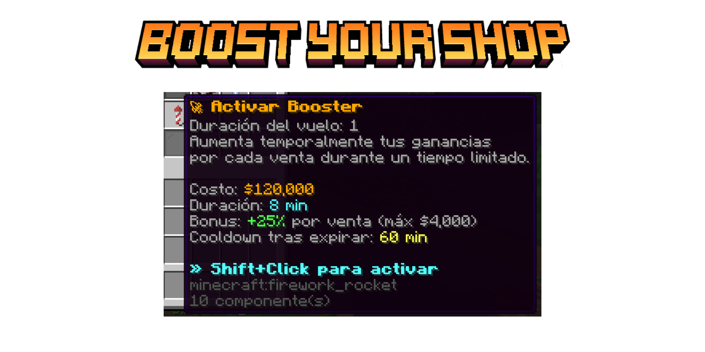
</p>

<p align="center">
  
</p>

<details>
<summary>

View Detailed Booster Infrastructure
</summary>

<br>

MobileShopASD includes a commercial booster system designed to amplify player trading activity.

###  Temporary Commercial Events

Boosters can:
- increase visibility
- improve profits
- reduce costs
- amplify rewards
- create temporary sales

###  Dynamic Marketplace Activity

The objective was making the marketplace feel dynamic and alive through temporary economic events.

</details>

---

<p align="center">
  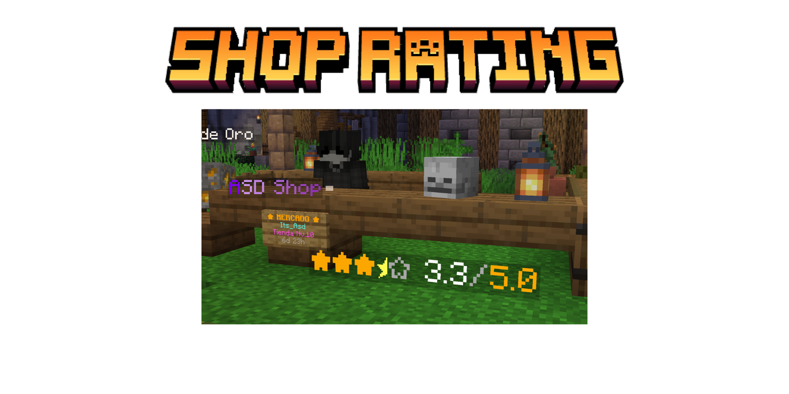
</p>

<p align="center">
  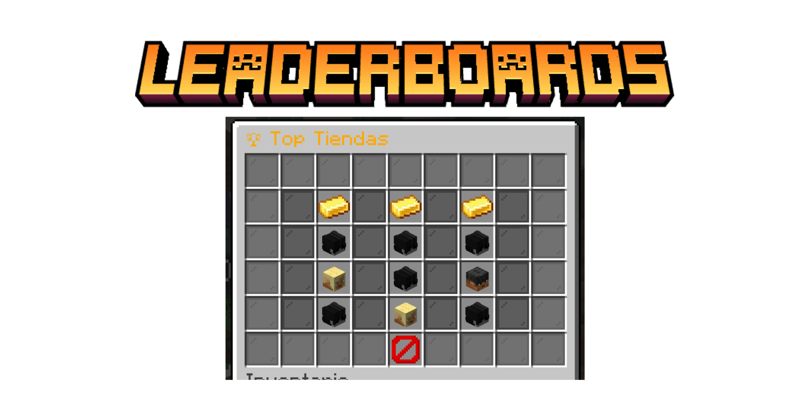
</p>

<p align="center">
  
</p>

<details>
<summary>

View Detailed Statistics Infrastructure
</summary>

<br>

MobileShopASD tracks extensive commercial statistics for every player shop.

###  Tracked Data

Statistics include:
- total sales
- total visits
- revenue
- ratings
- shop level
- popularity
- activity

###  Rating System

Players can rate shops using:
- stars
- tiers
- visual rankings
- reputation systems

creating competitive player-driven commerce.

### <span style="color:#F6B04E"><b>Leaderboard Infrastructure</b></span>

Supports:
- top sellers
- most visited shops
- highest rated shops
- top income
- progression rankings

</details>

---

<p align="center">
  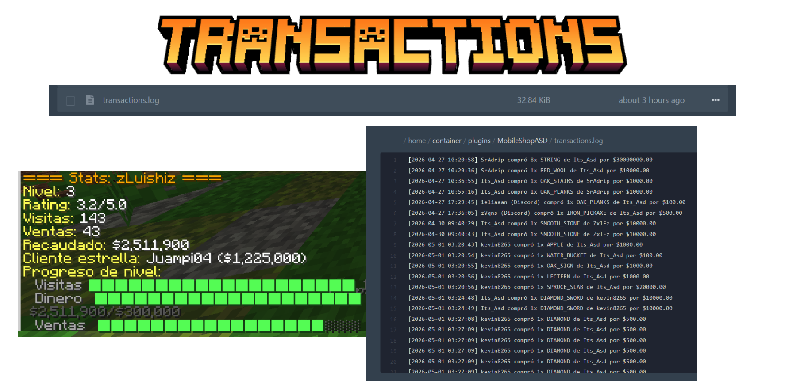
</p>

<p align="center">
  
</p>

<details>
<summary>

View Detailed Transaction Logs
</summary>

<br>

MobileShopASD stores transaction history to improve commercial transparency and management.

###  Logged Information

Tracks:
- buyer
- seller
- purchased items
- quantities
- prices
- timestamps
- completed transactions

This infrastructure improves:
- moderation
- economy control
- commercial tracking
- dispute management

</details>

---

#  PHYSICAL MARKET SYSTEM

<p align="center">
  
</p>

<p align="center">
  
</p>

<details>
<summary>

View Detailed Market System
</summary>

<br>

One of the most important systems inside MobileShopASD is the physical market infrastructure.

Players can rent real market stands directly inside the server world.

###  Real Marketplace Feeling

Every market stand can contain:
- NPCs
- holograms
- displays
- ratings
- timers
- player shops
- visual effects

creating a fully immersive trading district.

### <span style="color:#F6B04E"><b>World-Integrated Commerce</b></span>

The objective was making trading feel physically connected to the world instead of isolated menus.

</details>

---

<p align="center">
  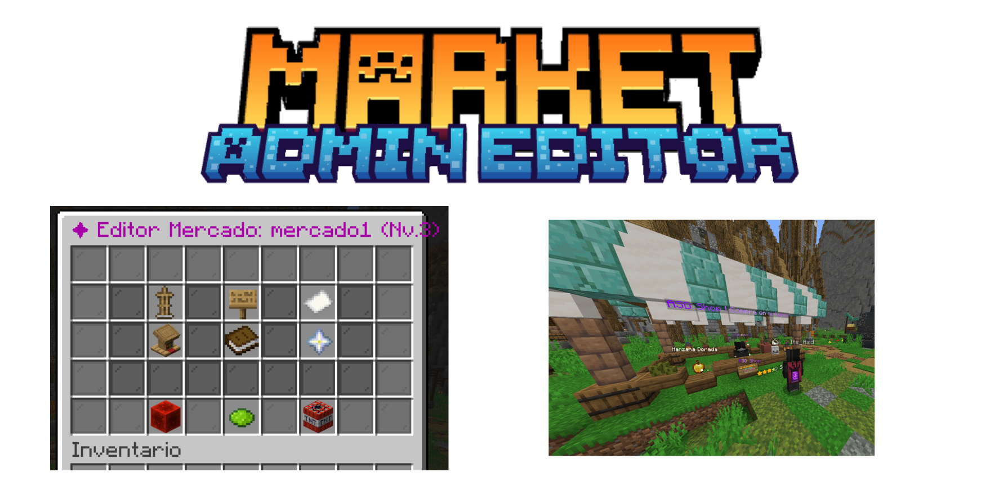
</p>

<p align="center">
  
</p>

<p align="center">
  
</p>

<details>
<summary>

View Detailed Market Administration
</summary>

<br>

Administrators can configure complete physical market infrastructures directly in-game.

###  Configurable Market Stands

Markets support:
- rental durations
- cooldowns
- NPC synchronization
- holograms
- displays
- ratings
- ownership
- progression requirements

allowing advanced commercial districts.

</details>

---

<p align="center">
  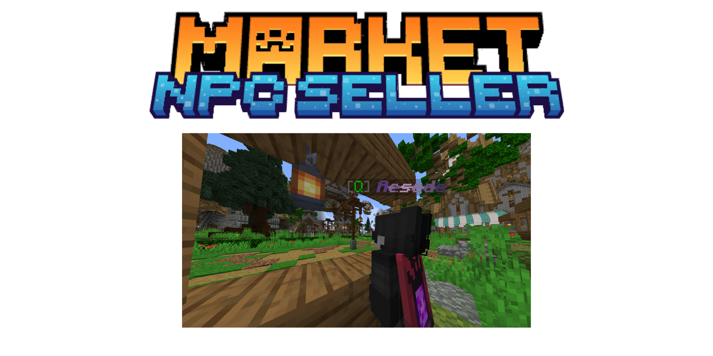
  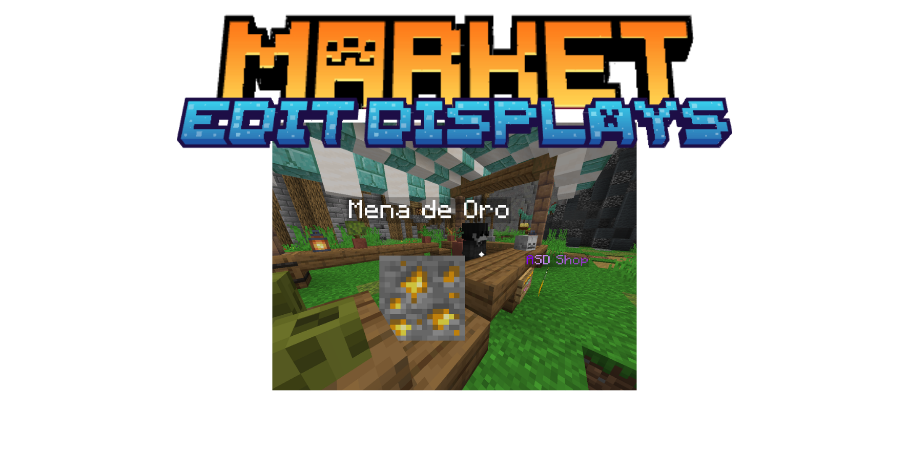
</p>

<p align="center">
  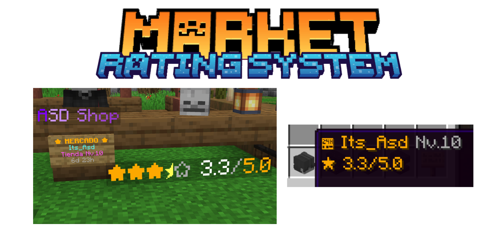
</p>

<p align="center">
  
</p>

<details>
<summary>

View Detailed Visual Infrastructure
</summary>

<br>

Market visuals were designed to improve immersion and make shops visually recognizable inside the world.

###  Visual Components

Supports:
- NPC shopkeepers
- item displays
- holograms
- star ratings
- tier visuals
- rotating showcases
- visual branding

creating realistic marketplace environments.

</details>

---

#  DISCORD COMMERCE

<p align="center">
  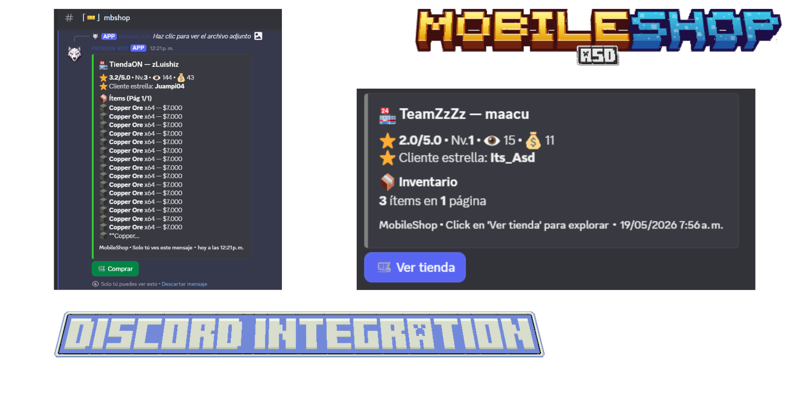
  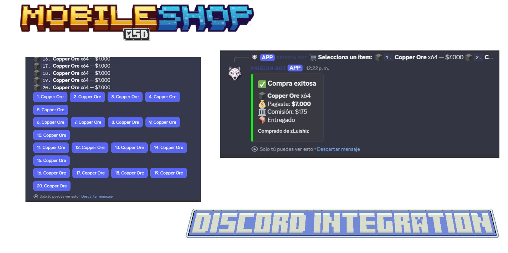
</p>

<p align="center">
  
</p>

<details>
<summary>

View Detailed Discord Commerce
</summary>

<br>

MobileShopASD includes a Discord synchronization infrastructure allowing players to interact with shops outside Minecraft.

###  Discord Commerce

Supports:
- embeds
- remote purchases
- shop publishing
- account linking
- transaction synchronization
- notifications

### <span style="color:#F6B04E"><b>Cross-Platform Marketplace</b></span>

Players can browse and purchase products directly from Discord while maintaining synchronization with Minecraft inventories and player data.

</details>

---

<p align="center">
  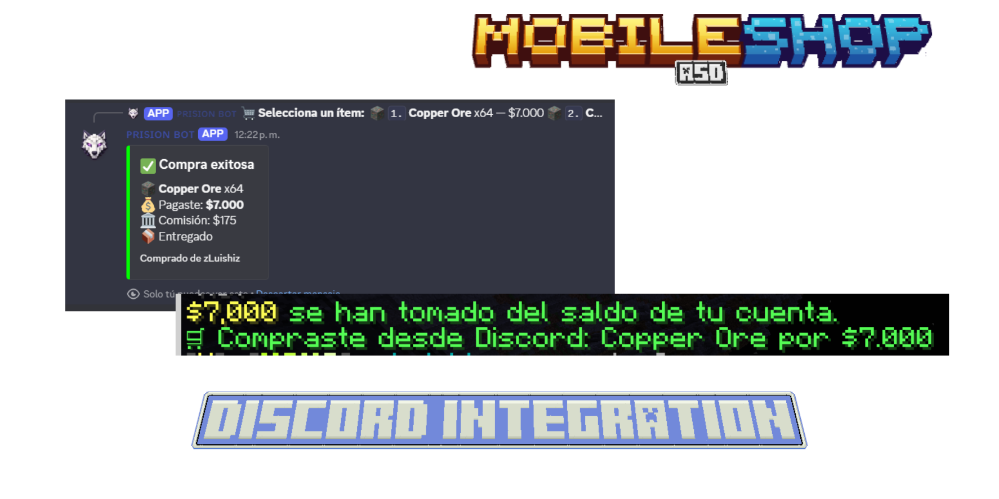
</p>

<p align="center">
  
</p>

<details>
<summary>

View Detailed Delivery System
</summary>

<br>

MobileShopASD includes a secure pending-delivery infrastructure.

###  Safe Transactions

Items are automatically stored if:
- the player is offline
- the inventory is full
- synchronization fails temporarily

This guarantees:
- secure commerce
- reliable purchases
- offline support
- transaction persistence

</details>

---

<p align="center">
  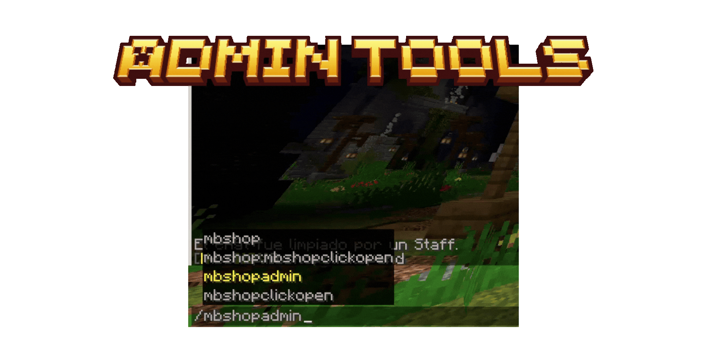
</p>

<p align="center">
  
</p>

<details>
<summary>

View Detailed Administration Tools
</summary>

<br>

MobileShopASD includes advanced administration tools for large economy servers.

###  Administrative Control

Administrators can:
- force upgrades
- manage statistics
- edit levels
- modify cooldowns
- synchronize markets
- configure NPCs
- manage shop rankings
- control economy flow

</details>

---

<p align="center">
  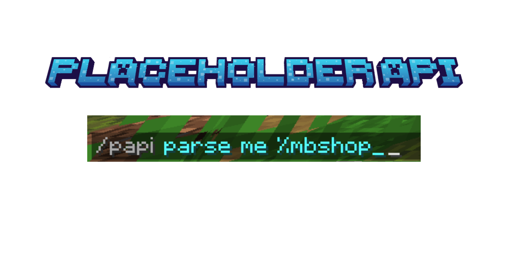
</p>

#  PLACEHOLDERAPI

```txt
%mbshop_level%
%mbshop_visits%
%mbshop_sales%
%mbshop_money%
%mbshop_rating%
%mbshop_top_1%
```

Supports:
- scoreboards
- holograms
- menus
- progression displays
- statistics systems

---

<p align="center">
  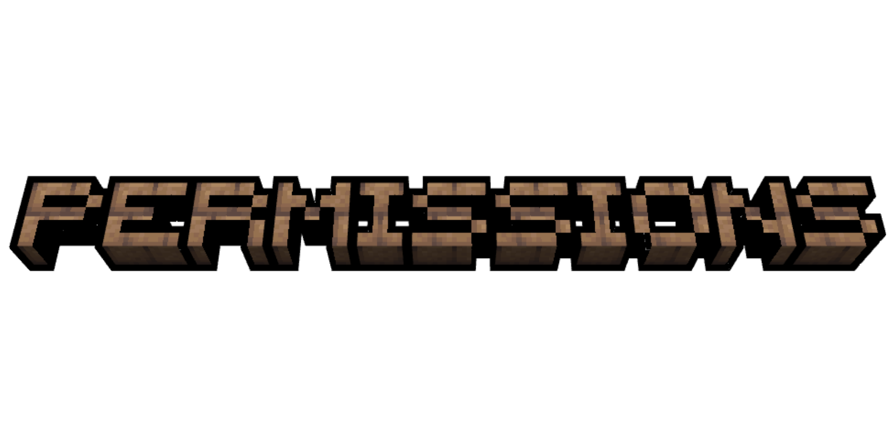
</p>

#  PERMISSIONS

```txt
mbshop.create
mbshop.edit
mbshop.admin
mbshop.market
mbshop.levelup
mbshop.booster
```

---

<p align="center">
  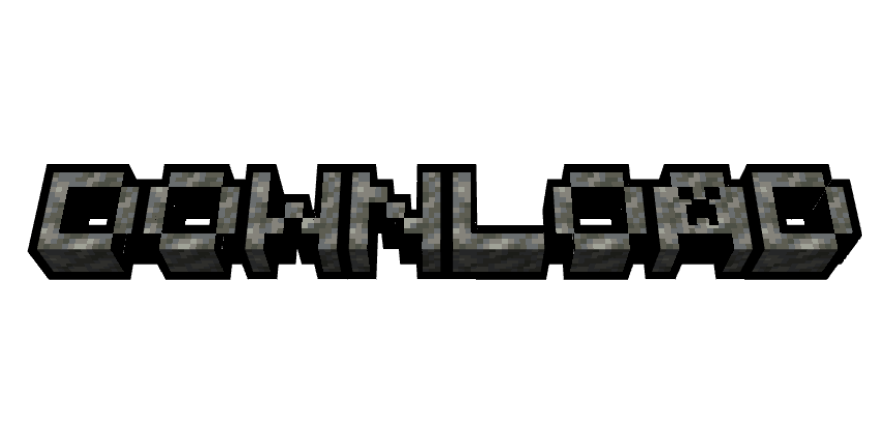
</p>

#  DOWNLOAD

MobileShopASD is distributed only as a compiled `.jar`.

The source code remains private because this plugin was developed exclusively for my own Minecraft infrastructure and gameplay ecosystem.

<p align="center">
  <a href="https://github.com/ItsAsddd/MobileShopASD/releases">
    
  </a>
</p>

---

```txt
Minecraft Version: 1.21.4
Server Software: Paper
Dependencies: PlaceholderAPI (Optional), Discord Integration (Optional)
Project Type: Personal / Private Infrastructure
Source Code: Private
Public Usage: Showcase only
```

<p align="center">
  
  
  
</p>
